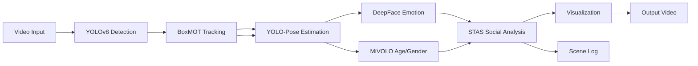

# IA Camera Challenge - Computer Vision Pipeline

A comprehensive CV pipeline for security camera analysis with real-time person detection, tracking, pose estimation, emotion analysis, and social interaction detection.

##  Features

###  Implemented
- **Object Detection** - YOLOv8m for human detection (Optimized for GTX 1650)
- **Multi-Object Tracking** - BoxMOT (DeepOCSORT) for persistent ID assignment
- **Pose Estimation** - YOLOv8m-pose for stable, high-speed body tracking
- **Emotion Analysis** - DeepFace for facial emotion recognition (Every 5 frames)
- **Age & Gender** - MiVOLO (Face + Body analysis) for accurate demographic estimation
- **Social Interaction Analysis (STAS)** - Geometry-based detection of social behaviors (Talking, Approaching, Service, etc.)
- **Scene Logging** - Text-based scene description with timestamps and interactions

## 📁 Project Structure

```
IA-Camera-Challenge/
├── cv_pipeline/
│   ├── detection/          # YOLOv8 detection module
│   ├── tracking/           # BoxMOT tracking module
│   ├── pose_estimation/    # Pose estimator (YOLO-based)
│   ├── emotion_analysis/   # DeepFace emotion module
│   ├── social_interaction/ # STAS Interaction Analyzer
│   └── utils/              # Scene describer & utilities
├── scripts/
│   └── run_full_pipeline.py  # Main entry point
├── vd2.mp4                 # Input video
├── output.avi              # Annotated video output (MJPG codec)
└── scene_log.txt           # Frame-by-frame event log
```

##  Quick Start

### Prerequisites
- Python 3.11
- NVIDIA GPU (GTX 1650 or better) with CUDA 12.1 drivers

### Installation
1. **Clone the repository**
```bash
git clone https://github.com/Amzilynn/IA-Camera-Challenge.git
cd IA-Camera-Challenge
```

2. **Create virtual environment**
```bash
python -m venv venv
.\venv\Scripts\activate
```

3. **Install dependencies**
```bash
# Core Torch with CUDA 12.1 support
pip install torch torchvision torchaudio --index-url https://download.pytorch.org/whl/cu121

# Core Requirements
pip install -r requirements.txt

# Critical dependency for TensorFlow 2.15 compatibility
pip install tf-keras

# Install MiVOLO manually if not in pip (or via git)
# Note: MiVOLO weights need to be downloaded manually (see Troubleshooting)
```

### Usage
**Run the full pipeline:**
```bash
# Run on default video (vd2.mp4)
python scripts/run_full_pipeline.py

# Run on webcam (Index 0)
python scripts/run_full_pipeline.py 0

# Run on specific video file
python scripts/run_full_pipeline.py path/to/video.mp4
```

### Troubleshooting
**MiVOLO Weights Missing**:
Download `model_imdb_cross_person_4.24_99.46.pth.tar` from [MiVOLO Releases](https://github.com/WildChlamydia/MiVOLO/releases) and place it in `models/mivolo_imbd.pth.tar`.

**Protobuf/TensorFlow Error**:
If you see `ImportError: cannot import name 'runtime_version' from 'google.protobuf'`, upgrade protobuf:
```bash
pip install protobuf==4.25.3
# or
pip install --upgrade protobuf
```

**Outputs:**
- `output.avi` - Annotated video with bounding boxes, skeletons, emotion, and interaction labels.
- `scene_log.txt` - Timestamped log including multi-person interactions.

##  Pipeline Architecture



##  Technical Details

### Detection (YOLOv8)
- **Model**: `yolov8m.pt` (Medium)
- **Face Model**: `yolov8n-face.pt` (Explicit detection before FER)
- **Confidence**: 0.35 threshold

### Tracking (BoxMOT)
- **Algorithm**: DeepOCSORT (BoostTrack)
- **Device**: CUDA (For GTX 1650 performance)

### Pose (Stable YOLO-Pose)
- **Model**: `yolov8m-pose.pt`
- **Benefit**: Much more stable than crop-based MediaPipe for moving crowds.

### Social Interaction (STAS)
- **Logic**: Spatial-Temporal heuristics using distance, facing angles (shoulders), and velocity.
- **Interactions**: Talking, Approaching, Walking Together, Service/Helping, Physical Contact.

##  Output Format

### Visual Output (`output.avi`)
- **Boxes**: ID-specific colors for tracked persons.
- **Skeletons**: Stable body keypoints.
- **Emotions**: Red labels above heads.
- **Age/Gender**: Displayed next to emotion.
- **Interactions**: Green `<< Label >>` tags between interacting people with connecting lines.

### Text Output (`scene_log.txt`)
```
Scene Log Started: 2026-01-24 23:45:00
--------------------------------------------------
[Frame 100] 23:45:10.123 | ID 1: Emotion=happy Pose=Tracked | Interaction(1&2): Talking
```

## Authors
**Amzilynn** - [GitHub](https://github.com/Amzilynn)

## Acknowledgments
- **YOLOv8/Pose** - Ultralytics
- **BoxMOT** - Multi-object tracking library
- **DeepFace** - Facial analysis framework
- **STAS** - Custom Social Interaction Framework
