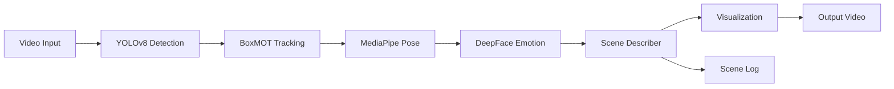

# Computer Vision Pipeline
A comprehensive CV pipeline for security camera analysis with real-time person detection, tracking, pose estimation, emotion analysis, and social interaction detection.
##  Features
###  Implemented
- **Object Detection** - YOLOv8-l for human detection
- **Multi-Object Tracking** - BoxMOT (DeepOCSORT) for persistent ID assignment
- **Pose Estimation** - MediaPipe BlazePose for skeleton tracking
- **Emotion Analysis** - DeepFace for facial emotion recognition
- **Scene Logging** - Text-based scene description with timestamps
- **Social Interaction Analysis (STAS)** - Context aware interaction detection
## 📁 Project Structure
```
IA-Camera-Challenge/
├── cv_pipeline/
│   ├── detection/          # YOLOv8 detection module
│   ├── tracking/           # BoxMOT tracking module
│   ├── pose_estimation/    # MediaPipe pose module
│   ├── emotion_analysis/   # DeepFace emotion module
│   └── utils/              # Scene describer & utilities
├── scripts/
│   └── run_full_pipeline.py  # Main entry point
├── vd2.mp4                 # Input video
├── output.mp4              # Annotated video output
└── scene_log.txt           # Frame-by-frame text log
```
##  Quick Start
### Prerequisites
- Python 3.12
- Virtual environment (recommended)
- CUDA-capable GPU (optional, CPU fallback available)
### Installation
1. **Clone the repository**
```bash
git clone https://github.com/Amzilynn/IA-Camera-Challenge.git
cd IA-Camera-Challenge
```
2. **Create virtual environment**
```bash
python -m venv venv
source venv/bin/activate  # On Windows: venv\Scripts\activate
```
3. **Install dependencies**
```bash
pip install torch torchvision torchaudio --index-url https://download.pytorch.org/whl/cu121  # For CUDA
# OR for CPU-only:
pip install torch torchvision torchaudio --index-url https://download.pytorch.org/whl/cpu
pip install -r requirements.txt
```
### Usage
**Run the full pipeline:**
```bash
python scripts/run_full_pipeline.py
```
**Outputs:**
- `output.mp4` - Annotated video with bounding boxes, IDs, skeletons, and emotion labels
- `scene_log.txt` - Timestamped text log of detections
##  Pipeline Architecture

##  Technical Details
### Detection (YOLOv8)
- **Model**: YOLOv8-l
- **Classes**: Person, pose keypoints, face regions
- **Confidence**: 0.5 threshold
### Tracking (BoxMOT)
- **Algorithm**: DeepOCSORT (BoostTrack)
- **Features**: Persistent IDs, trajectory tracking, occlusion handling
### Pose (MediaPipe)
- **Model**: BlazePose
- **Keypoints**: 33 body landmarks (3D coordinates)
- **Skeleton**: Shoulders, elbows, hips, knees, ankles
### Emotion (DeepFace)
- **Model**: VGG-Face
- **Emotions**: angry, sad, happy, fear, neutral, surprise
- **Frequency**: Every 5 frames (performance optimization)
##  Output Format
### Visual Output (`output.mp4`)
- Green bounding boxes around detected persons
- Persistent ID labels (e.g., "ID: 1")
- Yellow/cyan skeleton overlay (MediaPipe keypoints)
- Red emotion text above heads
### Text Output (`scene_log.txt`)
```
Scene Log Started: 2026-01-04 19:37:19
--------------------------------------------------
19:38:02.298 | [Frame 1] ID 1: Pose=Tracked
19:39:16.701 | [Frame 5] ID 1: Emotion=sad Pose=Tracked | [Frame 5] ID 2: Emotion=happy Pose=Tracked
```


## Authors
**Amzilynn** - [GitHub](https://github.com/Amzilynn)
## Acknowledgments
- **YOLOv8** - Ultralytics
- **BoxMOT** - Multi-object tracking library
- **MediaPipe** - Google
- **DeepFace** - Facial analysis framework
